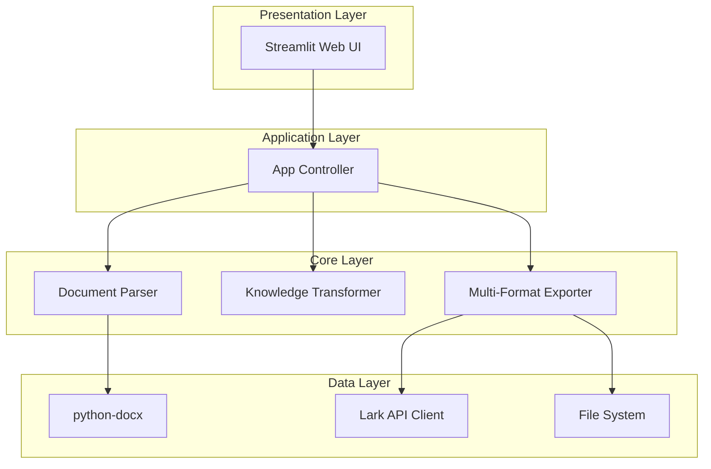
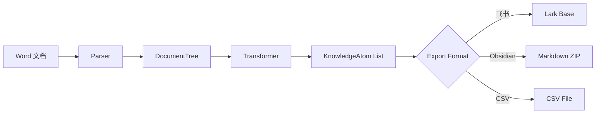

# Design Document: Knowledge Atomizer

## Overview

Knowledge Atomizer 是一个 Python ETL 系统，采用分层架构将 Word 文档转换为结构化知识原子。系统由三个核心层组成：解析层（Parser）、转换层（Transformer）、输出层（Exporter），通过 Streamlit Web 界面提供用户交互。

## Architecture



### 数据流



## Components and Interfaces

### 1. Document Parser (`parser.py`)

负责解析 Word 文档，提取层级结构。

```python
from dataclasses import dataclass
from typing import List, Optional
from enum import Enum

class HeadingLevel(Enum):
    H1 = 1
    H2 = 2
    H3 = 3
    H4 = 4
    H5 = 5
    BODY = 0

@dataclass
class DocumentNode:
    """文档节点，表示一个标题或段落"""
    id: str
    title: str
    content: str
    level: HeadingLevel
    children: List['DocumentNode']
    
@dataclass
class DocumentTree:
    """文档树，表示整个文档的层级结构"""
    source_file: str
    root_nodes: List[DocumentNode]

class DocumentParser:
    """Word 文档解析器"""
    
    def parse(self, file_path: str) -> DocumentTree:
        """解析 Word 文档，返回文档树"""
        pass
    
    def _extract_heading_level(self, paragraph) -> HeadingLevel:
        """从段落样式中提取标题层级"""
        pass
    
    def _convert_table_to_markdown(self, table) -> str:
        """将 Word 表格转换为 Markdown 格式"""
        pass
```

### 2. Knowledge Transformer (`transformer.py`)

将文档树转换为扁平化的知识原子列表。

```python
from dataclasses import dataclass
from typing import List, Optional

@dataclass
class KnowledgeAtom:
    """知识原子，最小知识单元"""
    id: str
    title: str
    content: str
    level: int
    parent_id: Optional[str]
    parent_title: Optional[str]
    source_file: str
    children_ids: List[str]

class KnowledgeTransformer:
    """知识转换器"""
    
    def transform(self, tree: DocumentTree) -> List[KnowledgeAtom]:
        """将文档树转换为知识原子列表"""
        pass
    
    def _flatten_tree(self, nodes: List[DocumentNode], parent: Optional[KnowledgeAtom]) -> List[KnowledgeAtom]:
        """递归扁平化文档树"""
        pass
```

### 3. Exporters (`exporters/`)

#### 3.1 Base Exporter

```python
from abc import ABC, abstractmethod
from typing import List

class BaseExporter(ABC):
    """导出器基类"""
    
    @abstractmethod
    def export(self, atoms: List[KnowledgeAtom]) -> ExportResult:
        """导出知识原子"""
        pass

@dataclass
class ExportResult:
    """导出结果"""
    success: bool
    message: str
    exported_count: int
    file_path: Optional[str] = None
```

#### 3.2 Lark Exporter (`exporters/lark_exporter.py`)

```python
class LarkExporter(BaseExporter):
    """飞书多维表格导出器"""
    
    def __init__(self, app_id: str, app_secret: str, base_id: str, table_id: str):
        self.client = LarkClient(app_id, app_secret)
        self.base_id = base_id
        self.table_id = table_id
    
    def export(self, atoms: List[KnowledgeAtom]) -> ExportResult:
        """批量写入飞书多维表格"""
        pass
    
    def _convert_to_lark_record(self, atom: KnowledgeAtom) -> dict:
        """将知识原子转换为飞书记录格式"""
        pass

class LarkClient:
    """飞书 API 客户端"""
    MAX_RETRIES = 3
    
    def get_access_token(self) -> str:
        """获取 tenant_access_token"""
        pass
    
    def batch_create_records(self, base_id: str, table_id: str, records: List[dict]) -> dict:
        """批量创建记录，支持自动重试"""
        pass
```

#### 3.3 Obsidian Exporter (`exporters/obsidian_exporter.py`)

```python
class ObsidianExporter(BaseExporter):
    """Obsidian 知识库导出器"""
    
    def export(self, atoms: List[KnowledgeAtom]) -> ExportResult:
        """生成 Obsidian Markdown 文件并打包为 ZIP"""
        pass
    
    def _generate_markdown(self, atom: KnowledgeAtom, all_atoms: List[KnowledgeAtom]) -> str:
        """生成单个 Markdown 文件内容"""
        pass
    
    def _generate_frontmatter(self, atom: KnowledgeAtom) -> str:
        """生成 YAML front matter"""
        pass
    
    def _generate_backlinks(self, atom: KnowledgeAtom, all_atoms: List[KnowledgeAtom]) -> str:
        """生成双向链接"""
        pass
```

#### 3.4 CSV Exporter (`exporters/csv_exporter.py`)

```python
class CSVExporter(BaseExporter):
    """CSV 导出器"""
    
    def export(self, atoms: List[KnowledgeAtom]) -> ExportResult:
        """生成 UTF-8 with BOM 编码的 CSV 文件"""
        pass
    
    def _escape_content(self, content: str) -> str:
        """转义内容中的特殊字符"""
        pass
```

### 4. Web UI (`app.py`)

```python
import streamlit as st

class KnowledgeAtomizerApp:
    """Streamlit Web 应用"""
    
    def run(self):
        """运行应用"""
        st.set_page_config(page_title="Knowledge Atomizer", layout="wide")
        self._render_sidebar()
        self._render_main()
    
    def _render_sidebar(self):
        """渲染侧边栏配置"""
        pass
    
    def _render_main(self):
        """渲染主内容区"""
        pass
    
    def _render_upload_section(self):
        """渲染文件上传区域"""
        pass
    
    def _render_preview_section(self, atoms: List[KnowledgeAtom]):
        """渲染预览区域，包含树形结构和统计信息"""
        pass
    
    def _render_export_section(self, atoms: List[KnowledgeAtom]):
        """渲染导出选项"""
        pass
```

## Data Models

### KnowledgeAtom Schema

| 字段 | 类型 | 描述 | 约束 |
|------|------|------|------|
| id | string | 唯一标识符 | UUID v4 |
| title | string | 标题 | 非空 |
| content | string | 内容（Markdown 格式） | 可为空 |
| level | int | 层级（1-5） | 1 ≤ level ≤ 5 |
| parent_id | string | 父节点 ID | 可为 null |
| parent_title | string | 父节点标题 | 可为 null |
| source_file | string | 来源文件名 | 非空 |
| children_ids | List[string] | 子节点 ID 列表 | 可为空列表 |

### 飞书多维表格字段映射

| KnowledgeAtom 字段 | 飞书字段名 | 飞书字段类型 |
|-------------------|-----------|-------------|
| id | 原子ID | 文本 |
| title | 标题 | 文本 |
| content | 内容 | 多行文本 |
| level | 层级 | 数字 |
| parent_title | 父节点 | 文本 |
| source_file | 来源文件 | 文本 |

</text>
</invoke>


## Correctness Properties

*A property is a characteristic or behavior that should hold true across all valid executions of a system—essentially, a formal statement about what the system should do. Properties serve as the bridge between human-readable specifications and machine-verifiable correctness guarantees.*

### Parser Properties

**Property 1: Heading Level Recognition**

*For any* valid Word document containing headings with styles Heading 1-5, the Parser SHALL correctly identify and return the corresponding HeadingLevel (H1-H5) for each heading.

**Validates: Requirements 1.2**

---

**Property 2: Table to Markdown Conversion**

*For any* Word table, converting it to Markdown and then parsing the Markdown back should produce a table with the same number of rows and columns, and equivalent cell content.

**Validates: Requirements 1.3, 2.5**

---

**Property 3: Paragraph Attribution**

*For any* document with headings and paragraphs, every paragraph SHALL be attributed to exactly one heading (the nearest preceding heading of higher or equal level), and no paragraph shall be orphaned.

**Validates: Requirements 1.4**

---

**Property 4: Invalid File Rejection**

*For any* file that is not a valid .docx file (including .txt, .pdf, .doc, corrupted files), the Parser SHALL raise a descriptive error rather than crash or return invalid data.

**Validates: Requirements 1.5**

---

### Transformer Properties

**Property 5: Atom Count Consistency**

*For any* DocumentTree with N heading nodes, the Transformer SHALL produce exactly N KnowledgeAtom objects.

**Validates: Requirements 2.1**

---

**Property 6: Atom Field Completeness**

*For any* KnowledgeAtom produced by the Transformer, it SHALL have non-null values for: id (valid UUID), title (non-empty string), level (1-5), and source_file (non-empty string).

**Validates: Requirements 2.2**

---

**Property 7: Parent-Child Relationship Integrity**

*For any* KnowledgeAtom with a non-null parent_id, there SHALL exist another KnowledgeAtom with that id, and the parent's level SHALL be less than the child's level.

**Validates: Requirements 2.3**

---

### Exporter Properties

**Property 8: Obsidian File Count**

*For any* list of N KnowledgeAtoms, the ObsidianExporter SHALL generate exactly N Markdown files.

**Validates: Requirements 4.1**

---

**Property 9: Obsidian Frontmatter Validity**

*For any* KnowledgeAtom, the generated Markdown file SHALL contain valid YAML frontmatter with fields: title, level, parent (if applicable), and source.

**Validates: Requirements 4.2**

---

**Property 10: Obsidian Bidirectional Links**

*For any* KnowledgeAtom with a parent, the generated Markdown SHALL contain a link in the format `[[parent_title]]`. *For any* KnowledgeAtom with children, the generated Markdown SHALL contain links to all children.

**Validates: Requirements 4.3, 4.4**

---

**Property 11: CSV Round-Trip Consistency**

*For any* list of KnowledgeAtoms, exporting to CSV and then parsing the CSV back SHALL produce records with equivalent id, title, content, level, parent_id, parent_title, and source_file values.

**Validates: Requirements 5.1, 5.3, 5.4**

---

**Property 12: CSV UTF-8 BOM Encoding**

*For any* exported CSV file, the first three bytes SHALL be the UTF-8 BOM (0xEF, 0xBB, 0xBF).

**Validates: Requirements 5.2**

---

### Statistics Properties

**Property 13: Statistics Count Consistency**

*For any* list of KnowledgeAtoms, the computed statistics SHALL satisfy: total_count equals list length, and sum of level_counts[1..5] equals total_count.

**Validates: Requirements 7.3**

---

## Error Handling

### Parser Errors

| 错误类型 | 触发条件 | 处理方式 |
|---------|---------|---------|
| FileNotFoundError | 文件路径不存在 | 返回明确错误信息，包含文件路径 |
| InvalidFileFormatError | 文件不是有效的 .docx | 返回支持的格式列表 |
| EmptyDocumentError | 文档没有任何内容 | 返回空的 DocumentTree |
| CorruptedDocumentError | 文档损坏无法解析 | 返回错误信息，建议重新导出文档 |

### Lark API Errors

| 错误类型 | 触发条件 | 处理方式 |
|---------|---------|---------|
| AuthenticationError | App ID/Secret 无效 | 显示配置指引链接 |
| PermissionError | 无权限访问多维表格 | 显示权限配置步骤 |
| RateLimitError | API 调用频率超限 | 自动等待后重试 |
| NetworkError | 网络连接失败 | 最多重试 3 次，显示网络诊断建议 |

### Export Errors

| 错误类型 | 触发条件 | 处理方式 |
|---------|---------|---------|
| DiskFullError | 磁盘空间不足 | 显示所需空间估算 |
| WritePermissionError | 无写入权限 | 建议选择其他目录 |

## Testing Strategy

### 测试框架选择

- **单元测试**: pytest
- **属性测试**: hypothesis (Python PBT 库)
- **集成测试**: pytest + pytest-mock (用于 API 模拟)

### 测试分层

```
tests/
├── unit/
│   ├── test_parser.py
│   ├── test_transformer.py
│   └── test_exporters.py
├── property/
│   ├── test_parser_properties.py
│   ├── test_transformer_properties.py
│   └── test_exporter_properties.py
└── integration/
    └── test_lark_integration.py
```

### 属性测试配置

- 每个属性测试运行最少 100 次迭代
- 使用 hypothesis 的 `@settings(max_examples=100)` 配置
- 每个测试需标注对应的设计属性编号

### 测试标注格式

```python
@given(...)
@settings(max_examples=100)
def test_heading_level_recognition(document):
    """
    Feature: knowledge-atomizer
    Property 1: Heading Level Recognition
    Validates: Requirements 1.2
    """
    # test implementation
```

### 生成器策略

为属性测试定义以下自定义生成器：

1. **DocumentGenerator**: 生成包含随机标题层级和内容的 Word 文档
2. **KnowledgeAtomGenerator**: 生成符合约束的 KnowledgeAtom 对象
3. **TableGenerator**: 生成随机行列数和内容的表格

### 覆盖率目标

- 核心解析逻辑: ≥ 90%
- 导出器: ≥ 85%
- 错误处理路径: ≥ 80%
